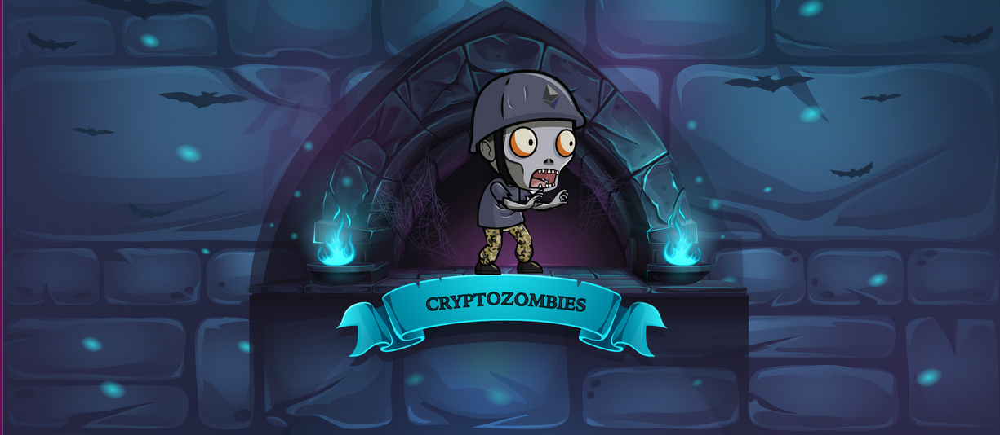

Below is the general progression of the contracts, each with their own sublessons (called chapters in the course):
 - Lesson 1: Making the Zombie Factory
 - Lesson 2: Zombies Attack Their Victims
 - Lesson 3: Advanced Solidity Concepts
 - Lesson 4: Zombie Battle System
 - Lesson 5: ERC721 & Crypto-Collectibles
 - Lesson 6: App Front-ends & Web3.js

Fun available at [cryptozombies.io](cryptozombies.io).
